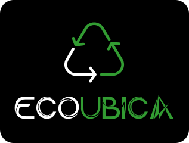

        
    </a>
        
    </a>

## Acerca de Ecoubica:

Ecoubica tiene como objetivo abordar la falta de información sobre puntos verdes y reciclaje en Santiago, Chile, y en todo el mundo.
Ecoubica busca promover la conciencia ambiental y prácticas sostenibles al proporcionar a los usuarios una plataforma para encontrar puntos verdes, informar sobre su estado y contribuir a la creación de un mapa global de estos puntos de reciclaje. También incluye la posibilidad de acceso a un banco de libros gratis y la generación de conciencia a través de contenido educativo sobre reciclaje y sostenibilidad.

## Acerca de GreenCode:

Nuestro equipo está conformado por:

Marcelo Darras: Líder de proyecto, responsable de la dirección y planificación.

Raúl Valenzuela: Programador principal, especialista en lenguajes de programación y desarrollo de software.

Francisca Herrera: Experta en documentación técnica y comunicación efectiva.

